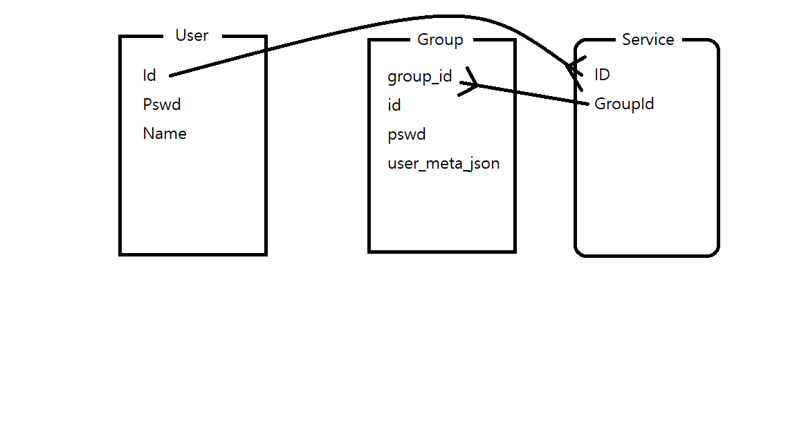
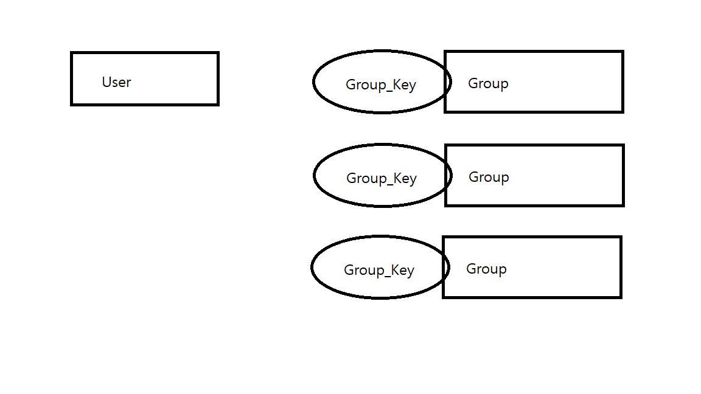

# LILA

LILA is Login API

## Discription

LILA는 로그인 기능을 구현하지 않아도 웹으로 쉽게 구현이 가능하게 하는 프로젝트입니다. RESTFUL API로 로그인 기능을 구현하며, 동적 할당이 가능합니다. GraphQL를 일부 채택하였으며 현재 Node로 구현된 구현체가 존재합니다. Mysql은 Docker로 실행됩니다. 현재 Django로 다시 제작중입니다.

## Requirements

- LILA :: Login
  - POST로 ID/PASSWORD전달받는다.
  - Group이 없다면 전체에서 찾고 아니면 그룹 내부에서 찾는다.
  - 로그인이 성공했는지 알려준다.

- LILA :: Register
  - POST로 Group/ID/PASSWORD전달받는다.
  - 내부 테이블에서 정보를 추가한다.
  - 회원가입이 성공했는지 알려준다.

- LILA :: Create
  - POST로 Group/---을전달받는다.
  - 내부 테이블을 생성한다.
  - 그룹이 중복이라면 실패하고 중복이 아니라면 성공한다.
  - 실행 결과를 알려준다.

## ERD

1:N인 User와 Table의 관계이다.

## Table

- User
  - ID
    - string
    - 유니크 키
  - Password
    - string
  - Name
    - string
    - NULL 가능

- Service
  - ID
    - string
    - 왜래키
  - Table ID
    - string
    - 왜래키

- Table
  - Group
    - string
  - Table ID
    - INT
    - 유니크 키
  - ID
    - string
  - Password
    - string
  - etc
    - 추가 가능

## Command

| End Point | arg | desription  |
| --------- |:---:| -----------:|
| Login/new     |  Id, pass, Name                    | [새로운 계정 등록](./Docx/login-new.md)|
| Group/new     |  Sc_Key, Name                      | 새로운 그룹 등록 |
| Group/add     |  Group_Sc, Id, password, json      | 새로운 유저 등록 |
| Group/change  |  Group_Sc, Id, json                | 유저 정보 변경   |
| Group/login   |  Group_Sc, Id, Password            | 그룹에 유저가 있는지 확인 |
| Account/group |                                    | 관리하는 그룹 표시 |
