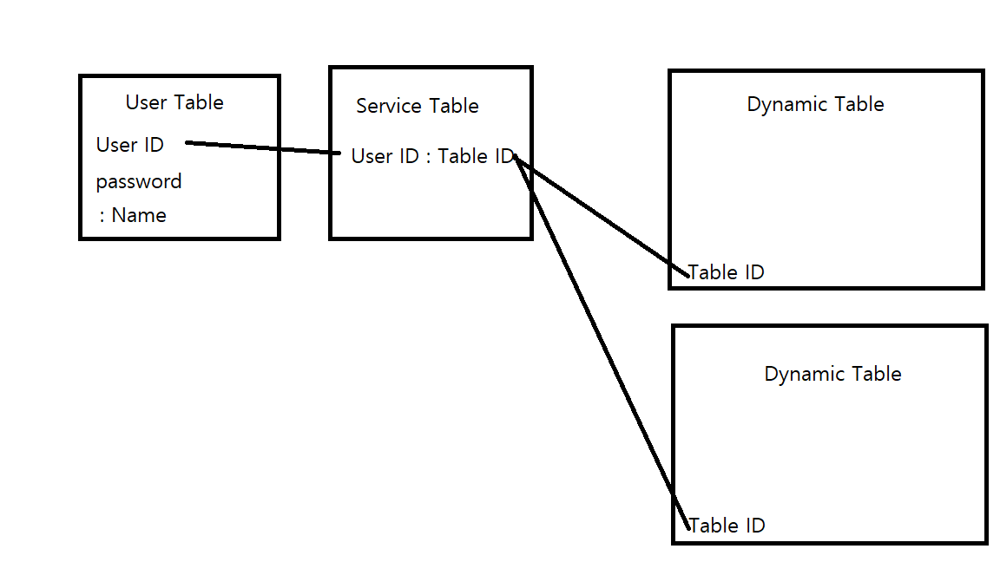

# LILA

LILA is Login API

## Discription

LILA는 로그인 기능을 구현하지 않아도 웹으로 쉽게 구현이 가능하게 하는 프로젝트입니다. RESTFUL API로 로그인 기능을 구현하며, 동적 할당이 가능합니다.

## Requirements

- LILA :: Login
  - POST로 ID/PASSWORD전달받는다.
  - Group이 없다면 전체에서 찾고 아니면 그룹 내부에서 찾는다.
  - 로그인이 성공했는지 알려준다.

- LILA :: Register
  - POST로 Group/ID/PASSWORD전달받는다.
  - 회원가입이 성공했는지 알려준다.

## ERD

## Table

- User
  - ID
    - string
  - Password
    - string
  - Name
    - string

- Service
  - ID
    - string
  - Table ID
    - string

- Table
  - Group
    - string
  - Table ID
    - INT
  - ID
    - string
  - Password
    - string
  - etc
    - 추가 가능